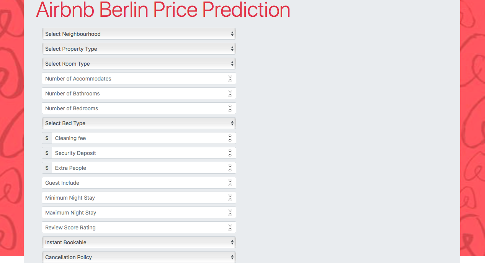

# AirBnb Berlin Price Prediction
Airbnb is a internet marketplace for home and apartment rentals. You can rent out your home, apartment or empty bedroom with the time you specify. One challange that airbnb hosts face is determining the optimal nightly price. 
Because Airbnb is a market place, the host can only set prices according to market prices. However, finding the right price from the market, it could be difficult. One method could be find the right price is, find a few listings that a similar to the place that will be up for rent, average the listed prices and set our price to this calculated average price. 
However, with the market being so dynamic, host would probably be looking to update the price regularly and this method can become difficult and take a lot time.
Moreover, this may not be very accurate because, as we are not taking into account other important factors that may give us a comparative advantage over other listings around us. This could be property characteristics such as number of rooms, bathrooms and extra services on offer.
The aim of this project is to propose a data-driven solution, by using machine learning to predict rental price. This project might help the host to set price for rent.

# 1. Dataset and Data Cleaning
Dataset has taken from [kaggle](https://www.kaggle.com/brittabettendorf/berlin-airbnb-data).
This dataset contains 96 columns and 22552 rows. In data cleaning step that i do:
1. Handle Missing Value.
2. Formatting Data.
3. Choose The feature that can be use for predict.

Features that i use for this project:
- neighbourhood_cleansed - the berlin property is in
- property_type - type of property, e.g. house or flat
- room_type - type of listing, e.g. entire home, private room or shared room
- accommodates - how many people the property accommodates
- bathrooms - number of bathrooms
- bedrooms - number of bedrooms
- bed_type - type of beds
- amenities - list of amenities
- price - nightly advertised price (the target variable)
- security_deposit - the amount required as a security deposit
- cleaning_fee - the amount of the cleaning fee
- guests_included - the number of guests included in the booking fee
- extra_people - the price per additional guest above the guests_included price
- minimum_nights - the minimum length of stay
- maximum_nights - the maximum length of stay
- review_scores_rating - guests can score properties
- instant_bookable - whether or not the property can be instant booked (i.e. booked straight away, without having to message the host first and wait to be accepted)
- cancellation_policy - the type of cancellation policy, e.g. strict or moderate
- reviews_per_month - calculated field of the average number of reviews left by guest each month

# 2. Feature Engineering
Before i do some modelling, i need to do feature engineering, since price prediction is regression problem, and most of best features in this project are categorical and do not fit into regression model, feature engineering that i use for this project is one hot encoding.
```python
import pandas as pd
df_dummies = pd.get_dummies(df,drop_first=True)
```

# 3. Modelling
In this step, i try using some model and the result:

|Model| MAE | RMSE | R2 |
| --- | --- | --- | --- |
|Linear Regression| 49.35 |	213.89 | 0.07 |
|Lasso| 43.21 |	201.79 | 0.05 |
|Ridge| 49.23	| 200.02 | 0.07 |
|Random Forest| 21.79 | 81.98 |	0.84 |
|XGBoost| 30.07 |	115.08 | 0.69 |
|LightGBM| 27.95 | 82.36 | 0.84 |

As you can see in the result above RMSE is big, so to improve R2 score and reduce the RMSE i decided to use hyperparameter, to find the best parameter i use GridSearchCV.

for linear regression:
```python
from sklearn.model_selection import GridSearchCV
from sklearn.linear_model import LinearRegression, Lasso, Ridge
from sklearn.ensemble import RandomForestRegressor
from xgboost import XGBRegressor
from lightgbm import LGBMRegressor
linear_regression = LinearRegression()
linear_param = {
    'fit_intercept': [True, False],
    'normalize': [True, False]}
linear_grid_search = GridSearchCV(linear_regression, linear_param)
linear_grid_search.fit(X_train, y_train)
```
for Lasso:
```python
lasso = Lasso()
lasso_params = {'alpha':[0.001,0.01,0.02, 0.024, 0.025, 0.026, 0.03],
               'fit_intercept':[True, False],
               'normalize':[True, False]}
lasso_grid_search = GridSearchCV(lasso, lasso_params)
lasso_grid_search.fit(X_train, y_train)
```
for Ridge:
ridge = Ridge()
```python
ridge_params = {'alpha':[0.001,0.01,0.02, 0.024, 0.025, 0.026, 0.03],
               'fit_intercept':[True, False],
               'normalize':[True, False]}
ridge_grid_search = GridSearchCV(lasso, lasso_params)
ridge_grid_search.fit(X_train, y_train)
```
for Random Forest:
```python
random_forest = RandomForestRegressor()
random_forest_params = {'n_estimators' : [100, 150, 200],
                        'bootstrap' : [True,False],
                        'min_samples_split' : [2,5,8,10,12]}
random_grid_search = GridSearchCV(random_forest, random_forest_params, cv=3, n_jobs=-1)
random_grid_search.fit(X_train, y_train)
```
for XGBoost:
```python
booster = XGBRegressor()
boost_param = {'n_estimators': [100, 150, 200],
              'learning_rate': [0.01, 0.05, 0.1], 
              'max_depth': [3, 4, 5, 6, 7],
              'colsample_bytree': [0.6, 0.7, 1],
              'gamma': [0.0, 0.1, 0.2]}
booster_grid_search = GridSearchCV(booster, boost_param, cv=3, n_jobs=-1)
booster_grid_search.fit(X_train, y_train)
```
for LightGBM:
```python
lgbm = LGBMRegressor()
lgbm_param = {
    'n_estimators': [20,40, 60, 80],
    'max_bin': [10, 20, 40, 60, 80, 100],
    'num_leaves': [10, 20, 40, 60, 80, 100],
    'learning_rate': [0.1, 0.05, 0.01]}

lgbm_grid_search = GridSearchCV(lgbm, lgbm_param, cv=3)
lgbm_grid_search.fit(X_train, y_train)
```
The result with using hyperparameters is:
|Model| MAE | RMSE | R2 |
| --- | --- | --- | --- |
|Linear Regression| 49.35 | 200.03 | 0.07 |
|Lasso| 40.63 |	200.92 | 0.06 |
|Ridge| 48.20	| 199.88 |	0.07 |
|Random Forest| 21.79	| 87.38 |	0.82 |
|XGBoost| 22.65 |	69.40 |	0.89 |
|LightGBM| 28.29 | 87.73 | 0.82 |

As you can see in the result above, the RMSE values of some models have increased and some have decreased as well as the R2 score, the XGBoost model has a smaller RMSE value and a greater R2 score than the other models, so the best model of this experiment is XGBoost.

# 4. Dashboard
After i do some experiment, next step i do is making a simple dashboard, This dashboard makes it easy for anyone who wants to start an airbnb business but is confused about pricing.
Existing content on the dashboard are as follows:
## Home


## Prediction
You can fill the form to predict the price.


## Visualization
This page is showing like average price in each neighbourhood etc.


## Map
This page is showing number of listing in each neighbourhood in berlin.


# 5. Conclusion
The best R2 score is 0.89 and the RMSE is 69.40 and such an RMSE value is a large enough value, which means, from this project there is still much that must be improved to reduce the value of RMSE, the smaller the RMSE value, the more accurate the prediction. things that might improve in this project are as follows:
- Remove outliers, because there are still many hosts who post unreasonable prices. might be improve R2 score and reduce RMSE value
- Try to do some experiment with different model and hyperparameters.


